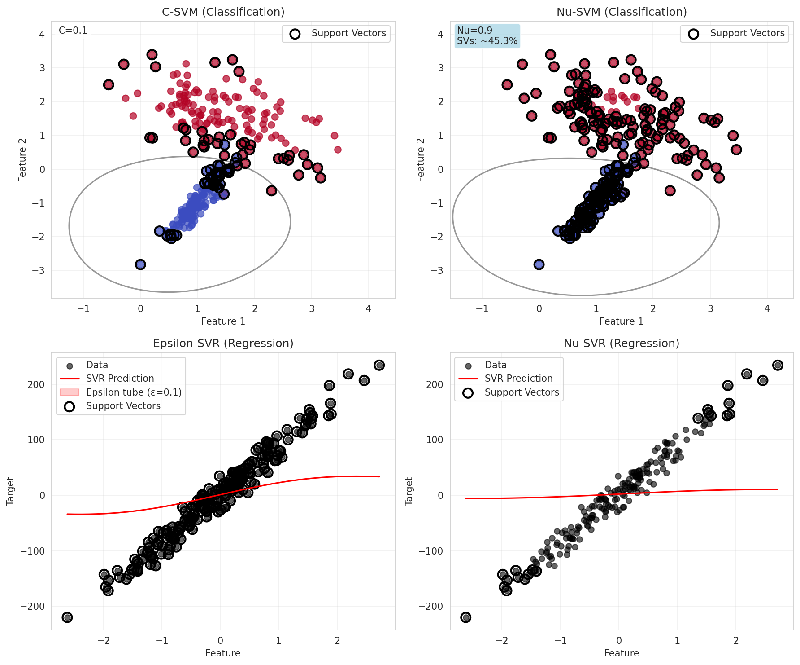
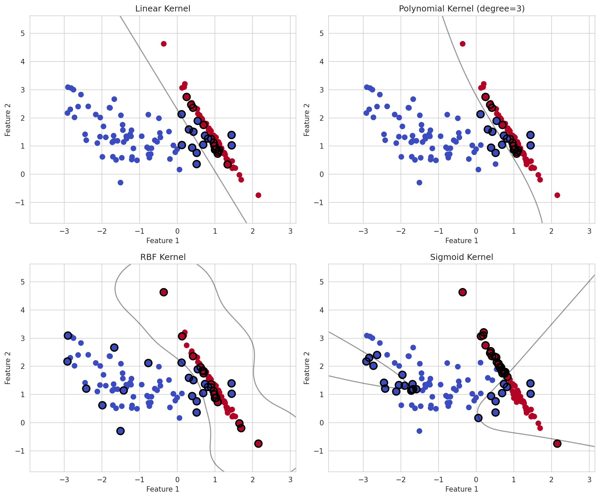
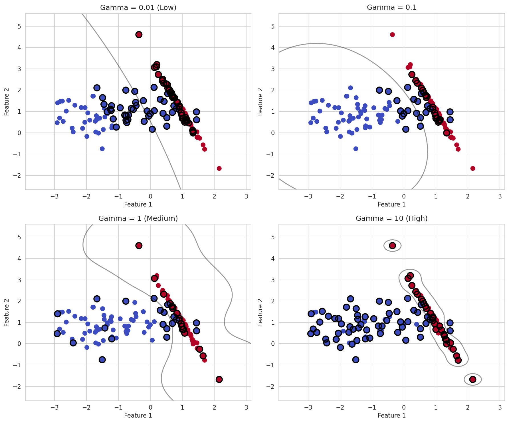
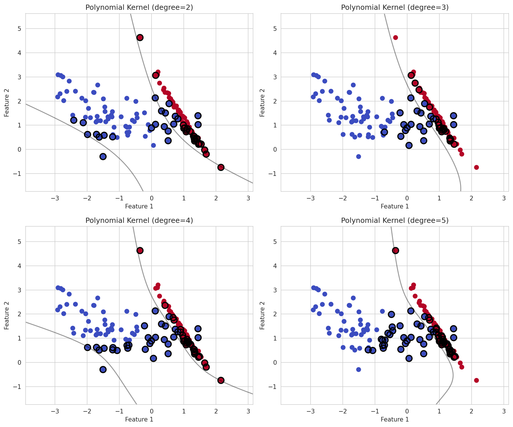
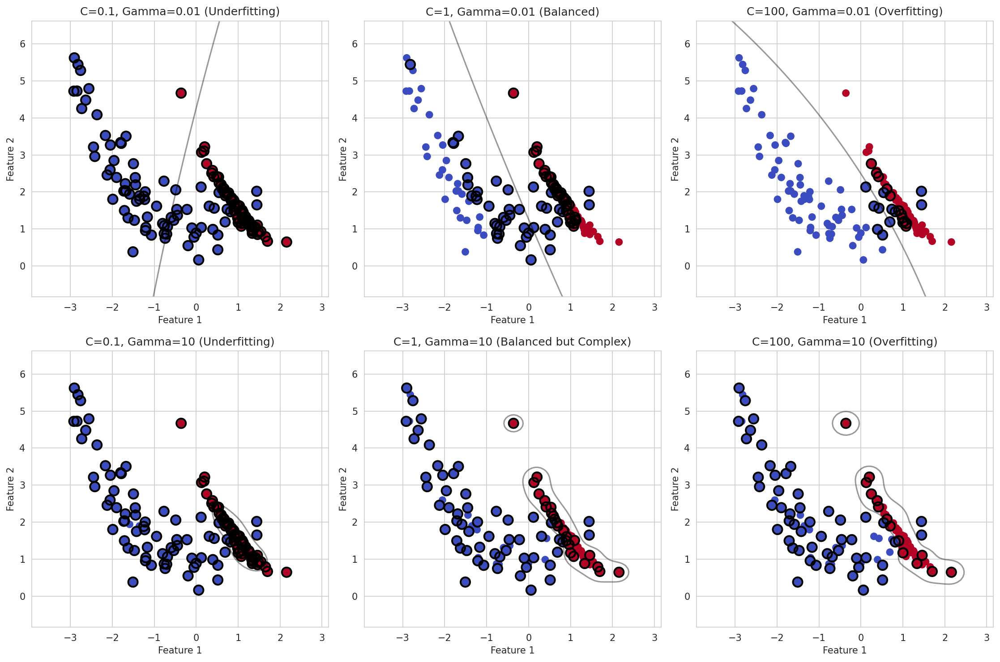
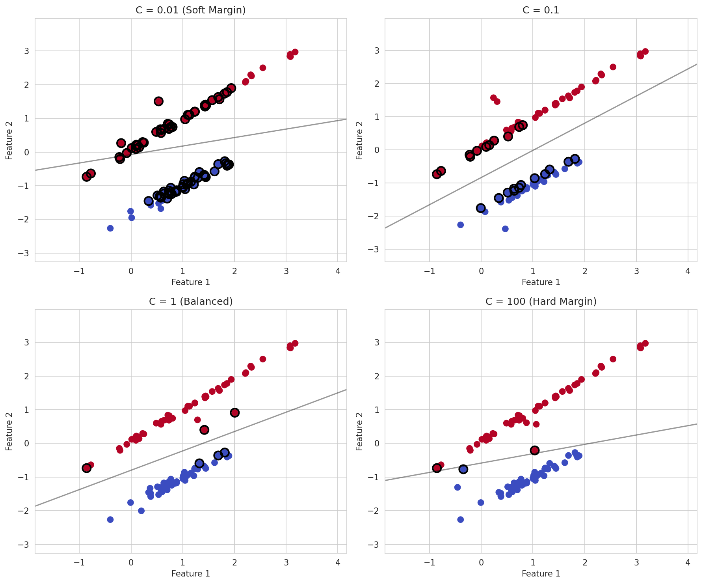

# Machine Learning Course Summary - Support Vector Machines (SVM)

## Table of Contents

1. [Introduction to Support Vector Machines](#introduction-to-support-vector-machines)
2. [Mathematical Foundation](#mathematical-foundation)
3. [SVM Variants](#svm-variants)
4. [Kernel Methods](#kernel-methods)
5. [Parameters and Tuning](#parameters-and-tuning)
6. [Applications and Benefits](#applications-and-benefits)
7. [Key Takeaways](#key-takeaways)

---

## <a name="introduction-to-support-vector-machines"></a>Introduction to Support Vector Machines

### What are Support Vector Machines?

Support Vector Machines (SVMs) are powerful supervised machine learning algorithms used for classification and regression tasks. The core idea is to find the optimal hyperplane that best separates different classes by maximizing the margin between them.

- **Maximum-margin classifier**: Finds the decision boundary that maintains the largest possible distance from the nearest training points
- **Support vectors**: Data points closest to the decision boundary that define the position of the hyperplane
- **Versatile**: Can be extended to non-linear problems using kernel functions

### How SVMs Work

SVMs follow a systematic approach to classification:

1. **Data preparation** 📊: Preparing training data with features and labels
2. **Hyperplane identification** 🔍: Finding the optimal separating hyperplane
3. **Margin maximization** 📈: Creating the largest possible gap between classes
4. **Support vector selection** 🎯: Identifying the critical data points that define the boundary
5. **Classification** 🧠: Using the trained model to predict new data points

#### SVM Workflow

```mermaid
graph TD
    A[Input Data<br/>Features & Labels] --> B[Feature Scaling<br/>Normalize Features]
    B --> C[Kernel Selection<br/>Choose Appropriate Kernel]
    C --> D[Parameter Tuning<br/>Set C, Gamma, etc.]
    D --> E[Model Training<br/>Optimize Hyperplane]
    E --> F[Support Vector Identification<br/>Find Critical Points]
    F --> G[Decision Boundary<br/>Maximize Margin]
    G --> H[Model Validation<br/>Test on Validation Set]
    H --> I{Satisfactory Performance?}
    I -->|No| D
    I -->|Yes| J[Model Deployment<br/>Predict New Data]
    
    style A fill:#2563eb20,stroke:#2563eb,stroke-width:2px
    style B fill:#7c3aed20,stroke:#7c3aed,stroke-width:2px
    style C fill:#16a34a20,stroke:#16a34a,stroke-width:2px
    style D fill:#0d948820,stroke:#0d9488,stroke-width:2px
    style E fill:#d9770620,stroke:#d97706,stroke-width:2px
    style F fill:#dc262620,stroke:#dc2626,stroke-width:2px
    style G fill:#0ea5e920,stroke:#0ea5e9,stroke-width:2px
    style H fill:#8b5cf620,stroke:#8b5cf6,stroke-width:2px
    style I fill:#a855f720,stroke:#a855f7,stroke-width:2px
    style J fill:#ec489920,stroke:#ec4899,stroke-width:2px
```

### Linear vs. Non-linear Classification

- **Linear SVM**: Works well when classes are linearly separable
- **Non-linear SVM**: Uses kernel trick to handle complex, non-linear decision boundaries

#### Example

If we have a dataset with two classes and want to classify new points:

```
Class A: (2, 3), (3, 4), (1, 2)
Class B: (6, 8), (7, 7), (5, 9)

SVM finds the optimal separating line that maximizes distance to nearest points from both classes.
```

---

## <a name="mathematical-foundation"></a>Mathematical Foundation of SVMs

### Linear SVM - Hard Margin

For linearly separable data, the SVM optimization problem can be expressed as:

Minimize: $\frac{1}{2}||\mathbf{w}||^2$

Subject to: $y_i(\mathbf{w} \cdot \mathbf{x_i} + b) \geq 1$ for all $i$

Where:

- $\mathbf{w}$ is the weight vector perpendicular to the hyperplane
- $b$ is the bias term
- $(\mathbf{x_i}, y_i)$ are the training data points with labels $y_i \in \{-1, +1\}$

### Soft Margin SVM

For non-separable data, we introduce slack variables $\xi_i$:

Minimize: $\frac{1}{2}||\mathbf{w}||^2 + C\sum_{i=1}^{n} \xi_i$

Subject to: $y_i(\mathbf{w} \cdot \mathbf{x_i} + b) \geq 1 - \xi_i$ and $\xi_i \geq 0$

Where $C$ controls the trade-off between maximizing margin and minimizing classification error.

### Support Vectors

- **Definition**: The data points that lie closest to the decision boundary
- **Role**: These points determine the position and orientation of the hyperplane
- **Significance**: Only these points affect the final model, making SVMs memory-efficient

#### SVM Visualization

The following plot shows an SVM decision boundary with support vectors highlighted:


### The Dual Problem

The optimization problem can be solved using Lagrange multipliers, leading to the dual formulation:

Maximize: $W(\alpha) = \sum_{i=1}^{n} \alpha_i - \frac{1}{2}\sum_{i,j=1}^{n} \alpha_i \alpha_j y_i y_j (\mathbf{x_i} \cdot \mathbf{x_j})$

Subject to: $\sum_{i=1}^{n} \alpha_i y_i = 0$ and $0 \leq \alpha_i \leq C$

Where $\alpha_i$ are the Lagrange multipliers.

---

## <a name="svm-variants"></a>SVM Variants

### 1. C-SVM (Classification)

For classification tasks with a soft margin parameter $C$:

- Controls trade-off between smooth decision boundary and classifying training points correctly
- Higher $C$ values penalize misclassification more heavily

### 2. Nu-SVM (Classification)

Uses a parameter $\nu$ instead of $C$:

- $\nu$ represents the upper bound on the fraction of training errors
- Directly controls the number of support vectors

### 3. Epsilon-SVR (Regression)

For regression tasks with an epsilon-insensitive loss function:

- Only penalizes errors that exceed a threshold $\epsilon$
- Points within $\epsilon$ distance from the predicted value have no penalty

### 4. Nu-SVR (Regression)

Similar to Nu-SVM but for regression:

- Uses $\nu$ to control the number of support vectors and training errors
- Alternative to Epsilon-SVR

### SVM Variants Comparison Table

The following table summarizes the key differences between various SVM variants:

| Variant | Purpose | Key Parameter | Behavior |
|---------|---------|---------------|----------|
| **C-SVM** | Classification | C | Trade-off between margin size and misclassification |
| **Nu-SVM** | Classification | Nu | Directly controls fraction of support vectors |
| **Epsilon-SVR** | Regression | Epsilon | Tolerance for errors in regression |
| **Nu-SVR** | Regression | Nu | Directly controls fraction of support vectors in regression |

### Visual Comparison of SVM Variants

The following visualization compares different SVM variants to illustrate how parameter choices affect the decision boundary and the number of support vectors:



---

## <a name="kernel-methods"></a>Kernel Methods

### The Kernel Trick

The kernel trick allows SVMs to operate in high-dimensional feature spaces without explicitly computing coordinates in that space. Common kernels include:

### 1. Linear Kernel

$K(\mathbf{x_i}, \mathbf{x_j}) = \mathbf{x_i} \cdot \mathbf{x_j}$

- Equivalent to standard linear SVM
- Efficient for linearly separable data
- No additional parameters

### 2. Polynomial Kernel

$K(\mathbf{x_i}, \mathbf{x_j}) = (\gamma \mathbf{x_i} \cdot \mathbf{x_j} + r)^d$

Where:

- $d$ is the degree of the polynomial
- $\gamma$ is the kernel coefficient
- $r$ is the independent term

### 3. RBF (Radial Basis Function) Kernel

$K(\mathbf{x_i}, \mathbf{x_j}) = \exp(-\gamma ||\mathbf{x_i} - \mathbf{x_j}||^2)$

- Most popular kernel for non-linear problems
- $\gamma$ controls the influence of each training example
- Equivalent to an infinite-dimensional feature space

### 4. Sigmoid Kernel

$K(\mathbf{x_i}, \mathbf{x_j}) = \tanh(\gamma \mathbf{x_i} \cdot \mathbf{x_j} + r)$

- Similar to neural network activation function
- Sometimes equivalent to two-layer perceptron

### Kernel Selection Guidelines

| Data Type | Recommended Kernel | Reason |
|-----------|-------------------|---------|
| **Large # features, small # samples** | Linear | Less prone to overfitting |
| **Small # features, large # samples** | RBF or polynomial | Captures non-linear relationships |
| **High-dimensional sparse data** | Linear | Computationally efficient |
| **Text classification** | Linear | Works well with high-dimensional data |

### Kernel Visualization

The following plot compares different SVM kernels on the same dataset:



---

## <a name="parameters-and-tuning"></a>Parameters and Tuning

### C Parameter (Regularization)

| Parameter | Description | Impact |
|-----------|-------------|---------|
| **C (Regularization)** | Controls trade-off between smooth decision boundary and classifying training points correctly | Higher C: More training points classified correctly, potential overfitting <br/> Lower C: Smoother decision boundary, potential underfitting |

### Gamma Parameter (Kernel Coefficient)

| Parameter | Description | Impact |
|-----------|-------------|---------|
| **Gamma (RBF)** | Controls how far the influence of a single training example reaches | Higher Gamma: Model fits training data more closely (overfitting risk) <br/> Lower Gamma: Model considers points farther from decision boundary |

For the RBF (Radial Basis Function) kernel: $K(\mathbf{x_i}, \mathbf{x_j}) = \exp(-\gamma ||\mathbf{x_i} - \mathbf{x_j}||^2)$

The gamma parameter controls how far the influence of a single training example reaches:

- **Low gamma**: Creates a smoother decision boundary, considering points farther from the decision boundary
- **High gamma**: Creates a more complex decision boundary, giving more influence to closer points

The following plot illustrates the effect of different gamma values on the RBF kernel:



### Polynomial Kernel Degree Effect

The polynomial kernel takes the form: $K(\mathbf{x_i}, \mathbf{x_j}) = (\gamma \mathbf{x_i} \cdot \mathbf{x_j} + r)^d$

The degree parameter $d$ controls the flexibility of the decision boundary:

- **Lower degrees**: Simpler, smoother decision boundaries
- **Higher degrees**: More complex, flexible decision boundaries that can capture more intricate patterns but risk overfitting

The following visualization demonstrates the effect of different polynomial degrees on the SVM decision boundary:



### Degree Parameter (Polynomial Kernel)

| Parameter | Description | Impact |
|-----------|-------------|---------|
| **Degree (Polynomial)** | Degree of the polynomial kernel function | Higher degree: More complex decision boundary <br/> Lower degree: Simpler decision boundary |

### Parameter Interactions

The performance of SVMs depends not only on individual parameters but also on their interactions.
The combination of C and gamma parameters significantly affects model complexity:

- **Low C and low gamma**: Creates a very simple model, potentially leading to underfitting
- **High C and high gamma**: Creates a very complex model, potentially leading to overfitting
- **Balanced values**: Typically results in good generalization performance

Understanding these interactions is crucial for effective hyperparameter tuning:

- **Low C, High gamma**: Model prioritizes smooth decision boundary over accurate classification of individual points, with high sensitivity to individual points
- **High C, Low gamma**: Model strongly prioritizes accurate classification of individual points, but with lower sensitivity to each point
- **High C, High gamma**: Model highly prioritizes accurately classifying individual points and is highly sensitive to each point, often leading to overfitting
- **Low C, Low gamma**: Model allows more misclassification in favor of a smoother decision boundary and broader generalization

The following visualization demonstrates how different combinations of C and gamma parameters affect model complexity:



#### Parameter Relationships

The following diagram shows how different SVM parameters interact:

```mermaid
graph LR
    A[C Parameter<br/>Regularization] --> D[Model Complexity]
    B[Gamma Parameter<br/>RBF Kernel] --> D
    C[Kernel Type] --> D
    D --> E[Overfitting Risk]
    D --> F[Underfitting Risk]
    E --> G[Generalization Error]
    F --> G
    G --> H[Cross-Validation Score]
    
    style A fill:#3498db,stroke:#2980b9,stroke-width:2px
    style B fill:#e74c3c,stroke:#c0392b,stroke-width:2px
    style C fill:#2ecc71,stroke:#27ae60,stroke-width:2px
    style D fill:#f39c12,stroke:#e67e22,stroke-width:2px
    style E fill:#e74c3c,stroke:#c0392b,stroke-width:2px
    style F fill:#3498db,stroke:#2980b9,stroke-width:2px
    style G fill:#9b59b6,stroke:#8e44ad,stroke-width:2px
    style H fill:#16a34a,stroke:#2ecc71,stroke-width:2px
```

### Parameter Tuning Strategies

1. **Grid search**: Systematically try different parameter combinations
2. **Cross-validation**: Use k-fold CV to evaluate performance on different subsets
3. **Start simple**: Begin with linear kernel and low parameter values
4. **Scale data**: Normalize features as SVMs are sensitive to feature scales

#### Parameter Tuning Process

Visualization of the effect of the C parameter on the SVM decision boundary:



```mermaid
flowchart TD
    A[Scale Data] --> B[Choose Initial Parameters]
    B --> C[Train SVM Model]
    C --> D[Evaluate with Cross-Validation]
    D --> E{Performance Satisfactory?}
    E -->|No| F[Tune Parameters]
    F --> C
    E -->|Yes| G[Final Model]
    
    style A fill:#2563eb20,stroke:#2563eb,stroke-width:2px
    style B fill:#7c3aed20,stroke:#7c3aed,stroke-width:2px
    style C fill:#16a34a20,stroke:#16a34a,stroke-width:2px
    style D fill:#0d948820,stroke:#0d9488,stroke-width:2px
    style E fill:#d9770620,stroke:#d97706,stroke-width:2px
    style F fill:#dc262620,stroke:#dc2626,stroke-width:2px
    style G fill:#0ea5e920,stroke:#0ea5e9,stroke-width:2px
```

### Epsilon Parameter in SVM Regression

The epsilon parameter (ε) defines the width of the epsilon-tube within which no penalty is associated with points predicted within the tube:

- **Larger ε**: More training points ignored, simpler model
- **Smaller ε**: Fewer training points ignored, more complex model

The following visualization shows how different epsilon values affect the regression model:


### Common Parameter Ranges

For grid search, commonly tested parameter ranges include:

- **C**: 0.01, 0.1, 1, 10, 100 (log scale)
- **Gamma**: 0.001, 0.01, 1 (log scale), if applicable
- **Degree**: 2, 3, 4 (for polynomial kernel)
- **Epsilon**: 0.01, 0.1, 0.5, 1.0 (for regression)

---

## <a name="applications-and-benefits"></a>Applications and Benefits

### Effectiveness

| Application Domain | Benefit | Key Advantage |
|-------------------|---------|---------------|
| **Image Classification** 📸 | Effective for high-dimensional data | Handles complex visual patterns |
| **Text Classification** 📚 | Works well with sparse high-dimensional vectors | Robust with bag-of-words representations |
| **Bioinformatics** 🧬 | Excels in high-dimensional gene expression data | Strong generalization with limited samples |
| **Handwriting Recognition** ✍️ | Robust to variations in writing styles | Effective with pixel-level features |

### Advantages

- **Effective in high-dimensional spaces**: Performs well when number of features is greater than number of samples
- **Memory efficient**: Uses only a subset of training points (support vectors) in decision function
- **Versatile**: Different kernel functions can be specified for decision function
- **Robust**: Relatively insensitive to overfitting in high-dimensional space

### Disadvantages

- **Scaling with sample size**: Training time is at least quadratic in the number of samples
- **No probability estimates**: Doesn't directly provide class probabilities
- **Sensitive to feature scaling**: Requires proper preprocessing of data
- **Difficult interpretation**: When using non-linear kernels, the model is difficult to interpret

### Real-World Applications

| Application | Use Case | Problem Type |
|-------------|----------|--------------|
| **Spam Detection** | Identifying unwanted emails | Classification |
| **Image Recognition** | Object detection and classification | Classification |
| **Gene Classification** | DNA microarray analysis | Classification |
| **Sentiment Analysis** | Understanding opinion in text | Classification |
| **Face Detection** | Identifying human faces in images | Classification |
| **Regression Analysis** | Predicting continuous values | Regression |

SVMs can also be used for regression tasks.

---

## <a name="key-takeaways"></a>Key Takeaways 🎯

### 1. Core Principles 🧠

| Principle | Description |
|-----------|-------------|
| **Maximum margin** | SVMs find the hyperplane that maximizes the margin between classes |
| **Support vectors** | Only the support vectors determine the decision boundary |
| **Kernel trick** | Enables SVMs to handle non-linear problems by mapping to higher dimensions |
| **Convex optimization** | SVMs solve a convex optimization problem ensuring a global optimum |

### 2. Algorithm Parameters ⚙️

| Parameter | Tuning Guideline |
|-----------|------------------|
| **C** | Higher values for less misclassification, lower values for smoother boundaries |
| **Gamma (RBF)** | Higher values for complex decision boundaries, lower for smooth boundaries |
| **Kernel selection** | Linear for high-dimensional data, RBF for complex non-linear patterns |
| **Feature scaling** | Always scale features before training SVM models |

### 3. Best Practices ✅

- 📊 **Feature scaling**: Always normalize or standardize features as SVMs are sensitive to feature scales
- 🔍 **Cross-validation**: Use k-fold CV to evaluate performance and tune hyperparameters
- 🧪 **Start simple**: Begin with linear kernel and simple parameters before trying complex kernels
- 📈 **Handle imbalanced data**: Use class weights or stratified sampling if dataset is imbalanced
- 🧩 **Optimize hyperparameters**: Use grid search or randomized search for optimal parameter combinations

### 4. When to Use SVMs 🎯

- **High-dimensional data** where the number of features is greater than the number of samples
- **Clear margin of separation** between classes exists in some transformed feature space
- **Text classification** problems with high-dimensional sparse features
- **When you need a classifier that is guaranteed to find the global optimum**
- **When you want memory-efficient storage of the model** (only support vectors are stored)

### 5. Performance Considerations ⚖️

- **Training time**: Can be slow for large datasets due to quadratic complexity
- **Memory usage**: Memory efficient at prediction time (only support vectors stored)
- **Prediction speed**: Fast once trained, as only support vectors are used
- **Scalability**: May not scale well to very large datasets (with millions of samples)

### 6. Advanced Techniques 🚀

- **Multi-class SVM**: One-vs-one or One-vs-all strategies for multi-class problems
- **Ensemble methods**: Combining multiple SVMs for improved performance
- **Feature selection**: Using SVM weights to identify important features
- **Anomaly detection**: One-class SVM for identifying outliers

Support Vector Machines provide a powerful and theoretically grounded approach to both classification and regression problems. Their effectiveness in high-dimensional spaces, particularly in text classification and image recognition, makes them valuable tools in the machine learning toolkit. However, their computational complexity and sensitivity to parameter choices mean they're best used after understanding the data characteristics and problem requirements. 🧠
